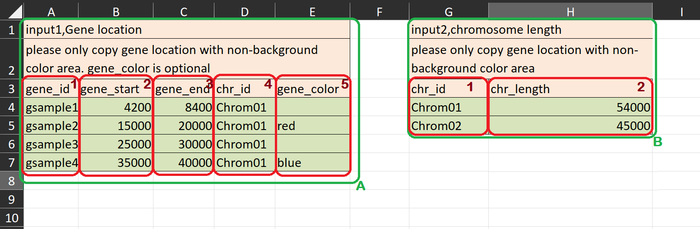

# Genetic Mapping with MG2C

MG2C is a user-friendly online tool for drawing genetic maps. The latest version is `2.1`. 

Old MG2C versions may be accessed below:

1. [v1.0](http://mg2c.iask.in/mg2c_v1.0)

2. [v1.1](http://mg2c.iask.in/mg2c_v1.1)

3. [v2.0](http://mg2c.iask.in/mg2c_v2.0)
  
For v`2.1`, users must provide their data as specified in the  
[`input_template.xlsx`](input_template.xlsx).

The input data are divided into two parts. A is gene location (`input1`),  
and B is chromosome length (`input2`). The former, part A, contains 5 fields: 
- `gene_ID`, 
- `gene_start`, 
- `gene_end`, 
- `chr_ID` and 
- `gene_color`.

The `gene_color` is an optional field used to customize color of the gene ID, with the default in black.

The latter, part B, contains two fields: 
- `chr_ID` and 
- `chr_length`. 

The delimiter between the fields is "TAB" (`&#9;`). Users copy and paste  
the input data into the corresponding textbox, left-click the "DRAW"button,  
and a genetic map will be generated by MG2C.

In addition, frequently asked questions are provided in [English](FAQ_EN.txt) and [Chinese](FAQ_ZH.txt).
